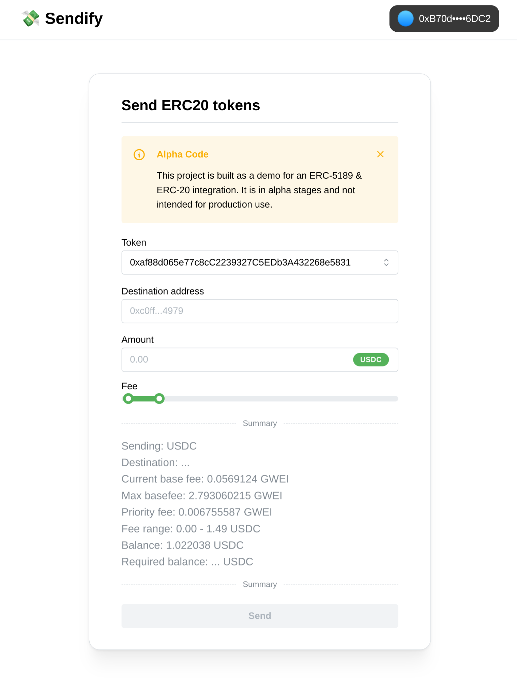

# Sendify: ERC5189 and ERC20 Token Integration Demo

## Overview

Sendify is a frontend demonstration project that showcases the integration between ERC-5189 operations and ERC-20 tokens. It utilizes a custom "handler" contract and an "endorser" to allow ERC-20 native transfers to be sent to the 5189 mempool. It allows users to send ERC-20 tokens from any EOA wallet, without the need to pay any fees in the native token. Instead, the fees are paid in the ERC-20 token itself.



## Usage

To set up Sendify locally, follow these steps:

1. **Clone the Repository**

   ```bash
   git clone https://github.com/Agusx1211/sendify
   ```

2. **Install Dependencies**

   Within the project directory, use Bun to install the necessary libraries:

   ```bash
   cd [project-directory]
   bun install
   ```

3. **OPTIONAL: Set Up Environment Variables**

   You can override the default configuration by creating a `.env` file in the project directory:

   ```bash
   cp .env.sample .env
   # Edit the .env file with your preferred settings
   ```

4. **Run the Application**

   Start the application with the following command:

   ```bash
   bun dev
   ```

   This will launch the development server and open the application in your web browser.

## Additional Resources

For further details about the smart contracts utilized in this project, please refer to the [ERC5189-ERC20 Handler repository](https://github.com/Agusx1211/ERC5189-ERC20-Handler).

**Note**: This project is a demonstration aimed at showcasing the technical feasibility of integrating ERC5189 with ERC-20 tokens on the Arbitrum network. It is for educational and demonstration purposes only and not suited for production use.
